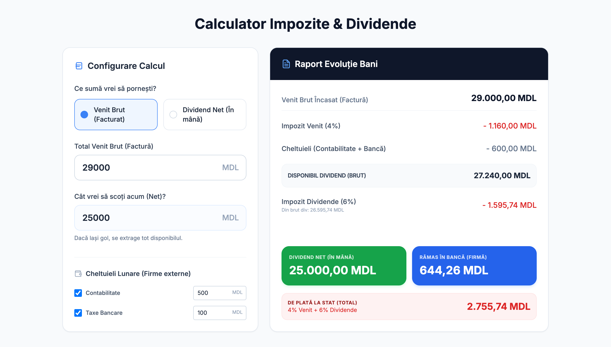

# 💰 Calculator Impozite & Dividende (SRL 4%)

O aplicație web modernă, simplă și eficientă pentru antreprenorii din Republica Moldova care vor să-și calculeze rapid bugetul pentru dividende, taxele către stat și suma optimă de facturat.

## 🚀 Funcționalități Principală

- **Dual-Mode de Calcul:**
  - **Venit Brut (Facturat):** Introduci suma totală încasată și afli cât îți rămâne "în mână" după toate taxele.
  - **Dividend Net (În mână):** Introduci suma pe care vrei să o scoți din firmă și afli exact cât trebuie să scrii pe factură.
- **Cheltuieli Lunare:** Posibilitatea de a bifa și deduce costurile cu contabilitatea și serviciile bancare.
- **Rezerve (Bani în Bancă):** Poți seta o sumă fixă care să rămână în contul firmei pentru cheltuieli viitoare.
- **Design Modern & Responsiv:** Optimizat special pentru mobil (iOS/Android) și desktop.
- **Favicon SVG:** Iconiță profesională integrată direct în cod.

## 📊 Logica de Calcul (RM)

Calculatorul respectă regimul de taxare pentru SRL-uri neplătitoare de TVA (Regim Simplificat):
1. **Impozit pe Venit:** 4% din totalul facturat (Venit Brut).
2. **Impozit pe Dividende:** 6% din suma retrasă din profitul net.
3. **Cheltuieli Deductibile:** Contabilitate și comisioane bancare.

## 🛠️ Tehnologii Folosite

- **HTML5 / CSS3** (Vanilla)
- **TailwindCSS** (via CDN) pentru design rapid și modern.
- **Inter Font Family** pentru o lizibilitate excelentă.
- **JavaScript (ES6)** pentru calcule instantanee fără reîncărcarea paginii.

## 📦 Cum îl folosești?

1. Descarcă fișierul `index.html`.
2. Deschide-l în orice browser modern.
3. Sau accesează-l direct via **GitHub Pages** la: `https://chiril-covali.github.io/div/`

---
Realizat pentru o gestionare financiară mai clară și rapidă. 🇲🇩